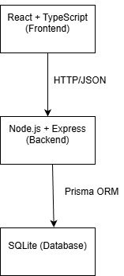
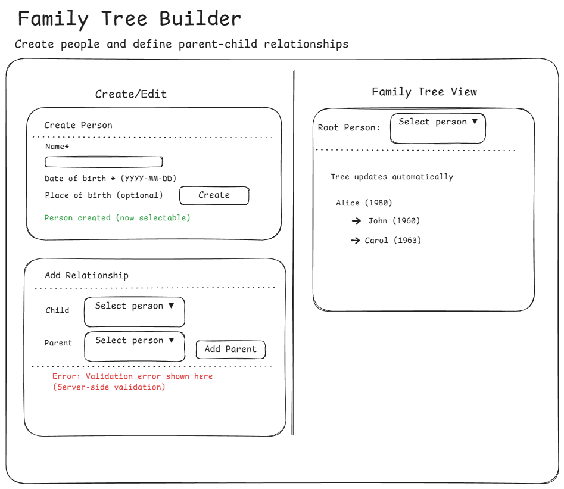

# Family Tree Mini-Builder

A small full-stack application for creating people and defining parent–child relationships.
Built as a technical showcase: clear UX, strong server-side validation, clean API design, and automated tests.

## Features
* Create people (name, date of birth, optional place of birth)

* Create parent–child relationships using a simple UI

* Server-side validation with meaningful error responses

* View the resulting family tree as a simple hierarchy

* Automated backend tests (Jest + Supertest)

##  Tech Stack

 Frontend: 

* React + TypeScript

* Vite

* react-hook-form

* Zod (schema-based validation)

Backend: 

* Node.js

* Express

* Prisma ORM

* SQLite (local database)

* Jest + Supertest (API testing)

## Architecture Overview

The application follows a simple layered architecture where the backend acts as the single source of truth.



### Description

- The **Frontend** (React + TypeScript) calls backend via HTTP / JSON
- The **Backend** (Node.js + Express) enforces validation & business rules
- The **Database** SQLite persists people and relationships
- Prisma is used for database access


## UX Overview

The following wireframe illustrates the intended user experience and layout of the application.



Diagrams were created using **Excalidraw** and **draw.io**.


## Data Model and Validation

### Data Model

- **Person**
  - id (UUID)
  - name
  - dateOfBirth
  - placeOfBirth (optional)

- **Relationship**
  - id (UUID)
  - parentId
  - childId

People and relationships are stored separately to allow flexible parent–child mappings.

### Validation Rules (Server-side)

All relationship rules are enforced in the backend:

| Rule                                                  | Error code                       |
| ----------------------------------------------------- | -------------------------------- |
| A child can have **0–2 parents**                      | `TOO_MANY_PARENTS`               |
| Parent must be at least **15 years older** than child | `AGE_RULE`                       |
| Parent and child cannot be the same person            | `SELF_PARENT`                    |
| Duplicate relationship not allowed                    | `DUPLICATE`                      |
| Cycles are not allowed (no ancestor loops)            | `CYCLE`                          |
| Date of birth is required and cannot be in the future | (validated when creating person) |


## Running the Application

### Run with Docker

#### Prerequisites
- Docker + Docker Compose

```bash
docker compose up --build
```

The UI will be available at:

http://localhost:5173

The backend will be availabe at:

http://localhost:4000

Notes:

- SQLite database is created locally via Prisma.

- VS Code note: if you open the repo without installing dependencies locally, TypeScript may show red squiggles. Fix once:
```bash
cd backend && npm install && npx prisma generate
cd ../frontend && npm install
```

## API Overview

Base URL: `http://localhost:4000`

### Endpoints
- `GET /health`
- `GET /api/people`
- `POST /api/people`
- `POST /api/relationships`
- `GET /api/tree/:rootId`

### Create a Person
**POST** `/api/people`

Request:

```json
{
  "name": "Alice",
  "dateOfBirth": "1980-01-02",
  "placeOfBirth": "Helsinki"
}

```
Response (201):

```json
{
  "data": {
    "id": "uuid",
    "name": "Alice",
    "dateOfBirth": "1980-01-02T00:00:00.000Z",
    "placeOfBirth": "Helsinki"
  }
}
```

### Add Parent–Child Relationship: 

POST /api/relationships: 

```json

  {
    "parentId": "uuid",
    "childId": "uuid"
  }
  ```
Response (201):
```json
{
  "id": "uuid",
  "parentId": "uuid",
  "childId": "uuid"
}
```

### Get Family Tree

GET /api/tree/:rootId

Returns a recursive tree structure starting from the selected root person.

### Example error response

Response (400/409):
```json
{
  "error": {
    "code": "AGE_RULE",
    "message": "Parent must be at least 15 years older than child"
  }
}
```


## Testing

Backend tests validate:

- Relationship creation.

- AGE_RULE (15-year rule).

- TOO_MANY_PARENTS (max 2 parents).

- DUPLICATE relationship prevention.

- Defensive cycle detection (CYCLE) using a seeded reverse-edge scenario.

### Backend (API)

```bash 
cd backend
npm test
```

Frontend: 

```bash 
cd frontend
npm test
```
All tests should pass 

## Design Decisions
- Backend is the source of truth: all validation rules are enforced server-side.
- Frontend uses react-hook-form + Zod for fast UX validation only.
- Tree view is rendered recursively for clarity and simplicity.
- SQLite + Prisma chosen for fast local setup and predictable relational integrity.

## AI Usage

**Tools used:** ChatGPT, GitHub Copilot

AI was used to speed up routine work (scaffolding, small refactors, and generating test/edge-case ideas).  
All key logic and design decisions were implemented and verified by me, including cycle prevention (DFS ancestor check) and consistent server-side validation.  
I validated behavior by running automated tests and manually exercising the main UI flows.


## What I would do with more time

- **Visual tree layout:** Replace list rendering with a simple graph/DAG visualization.
- **Edit / delete flows:** Add safe mutation operations with validation to prevent breaking existing relationships.
- **Accessibility:** Improve keyboard navigation, focus states, and screen-reader labels.
- **Scalability:** Add pagination or lazy-loading for large datasets.
- **Rate limiting:** Add per-IP limits for write endpoints and return `429 Too Many Requests`.
- **Auth & roles:** Restrict relationship changes based on user roles/ownership.
